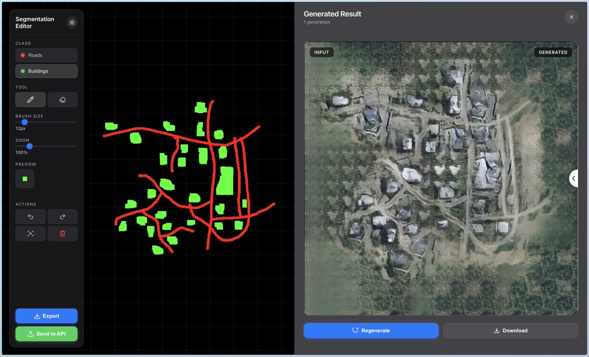

# Segmentation Mask Editor

A beautiful, Apple-inspired React web application for creating segmentation masks for ML training. Features an infinite canvas with pan and zoom, drawing masks with separate color channels for roads (red) and buildings (green).

**This project is just a simple frontend built to work alongside (SatGen-CV)[https://github.com/Guereak/SatGen-CV]. If you want to try it out, make sure you have SatGen-CV up and running alongisde it.**



## Getting Started

### Install Dependencies

```bash
npm install
```

### Run Development Server

```bash
npm run dev
```

Then open your browser to the URL shown (usually http://localhost:5173)

### Build for Production

```bash
npm run build
```

The built files will be in the `dist` directory.

## Usage

### Drawing
1. **Select Class**: Choose "Roads" or "Buildings"
2. **Choose Tool**: Use "Brush" to draw or "Eraser" to remove
3. **Adjust Brush Size**: Use the slider (1-100px)
4. **Draw**: Click and drag anywhere on the canvas